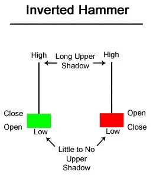
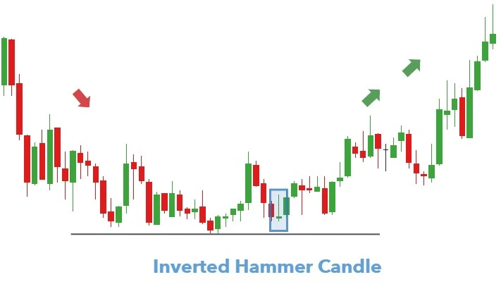
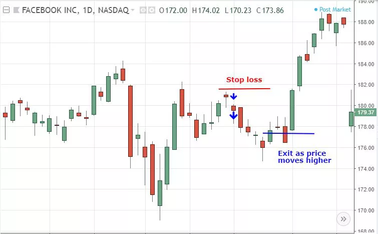
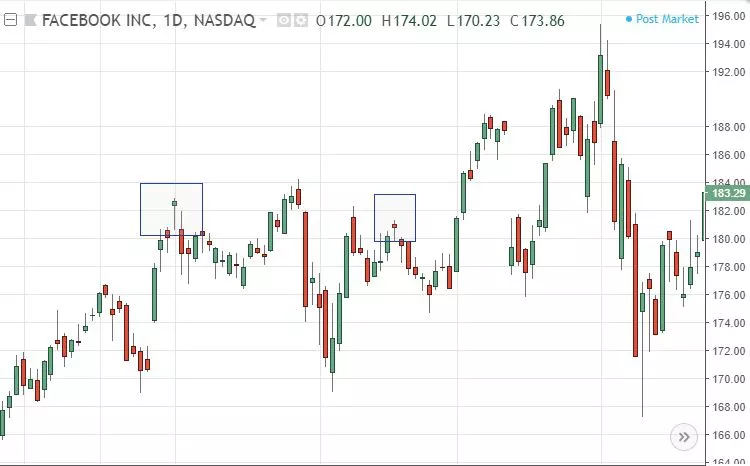

# Hammer Candlestick

## What is a hammer candlestick?

Traders in the financial market
often use candlestick charts as a good visual aid to analyze and monitor the performance of a specific price
in a given time period. They have the most flexibility to understand the
trend of the market. The model can help traders measure the market sentiment of
financial assets. For example, the hammer candle is a bullish
pattern, which is formed when the asset price falls from its opening price of
and is close to the support level, and only rebounds at
and closes at a high level.

When it comes to bullish candles, a popular pattern is the
hammer candle formation. The hammer is one of the most important
reversal patterns that traders should pay attention to. The hammer is considered a bullish reversal from
, but only when it appears under certain conditions. The
pattern generally forms near the bottom of a downtrend, indicating that the market is trying to define the lower.

The hammer candle is at the bottom of the downtrend and
indicates a possible (bullish) reversal in the market. The hammer line is the
candlestick pattern. When the stock opens, it drops sharply during the day, and then
rebounds to near the opening price. The
candle pattern looks like a hammer. The long lower wick at the low point of the day looks like
. The handle and the main body of the opening and closing prices form the head of
that looks like a hammer. The lower wick is usually twice the size of the
candle body, but it can be larger. For a clear understanding of the Hammer
candle and its appearance, please refer to the table below.

When the high and the closing price of
are equal, a bullish hammer candle forms. It is considered a stronger pattern because the
bulls can completely reject the shorts and the bulls can push the price higher at
before the opening price.

The long lower shadow of the hammer indicates that the market tested
for support and demand. When the market found the support area of the day low of
, the bulls started to push the price higher and
was close to the opening price. Therefore, the bearish push to the downside was rejected by the bulls at.

The long lower shadow of the hammer indicates that the market tested
for support and demand. When the market found the support area of the day low of
, the bulls started to push the price higher and
was close to the opening price. Therefore, the bearish push to the downside was rejected by the bulls at.

The long lower shadow of the hammer indicates that the market tested
for support and demand. When the market found the support area of the day low of
, the bulls started to push the price higher and
was close to the opening price. Therefore, the bearish push to the downside was rejected by the bulls at
.

### Inverted Hammer

Inverted Hammer candlesticks mainly occur at the bottom of the
downtrend, which can be used as a warning of possible reversal upward.
**It should be noted that the reversal pattern is a warning of
's potential price changes, and is not a signal to buy in itself**. The
inverted hammer, like the shootig star, is created when the opening, low, and closing prices of
are approximately the same. In addition, there is a very long top shadow of
, which should be at least twice the length of the actual
body. When the low and the opening price are equal, the
inverted hammer bullish candle is formed, which is considered a stronger bullish signal.
After a long downtrend, the formation of an inverted hammer
is bullish, because the price rises
sharply during the day and is hesitant to move down. Despite this, sellers re-enter stocks, futures,
or the currency and push the price back near the open, but the fact that the price of
may rise significantly indicates that the bulls are testing the price. power of the
bears. What happened the day after the
hammer pattern reversal allowed traders to know if the price of
would rise or fall.

### Limitation

There is no guarantee that the price will continue to rise
after the candle is confirmed. The long shadow hammer and the powerful
confirmation candle can push the price higher in two periods.
This may not be an ideal buy point, because the stop loss may be far from the entry point, putting traders at risk, and does not justify the potential return.

### Formation Chart Example

