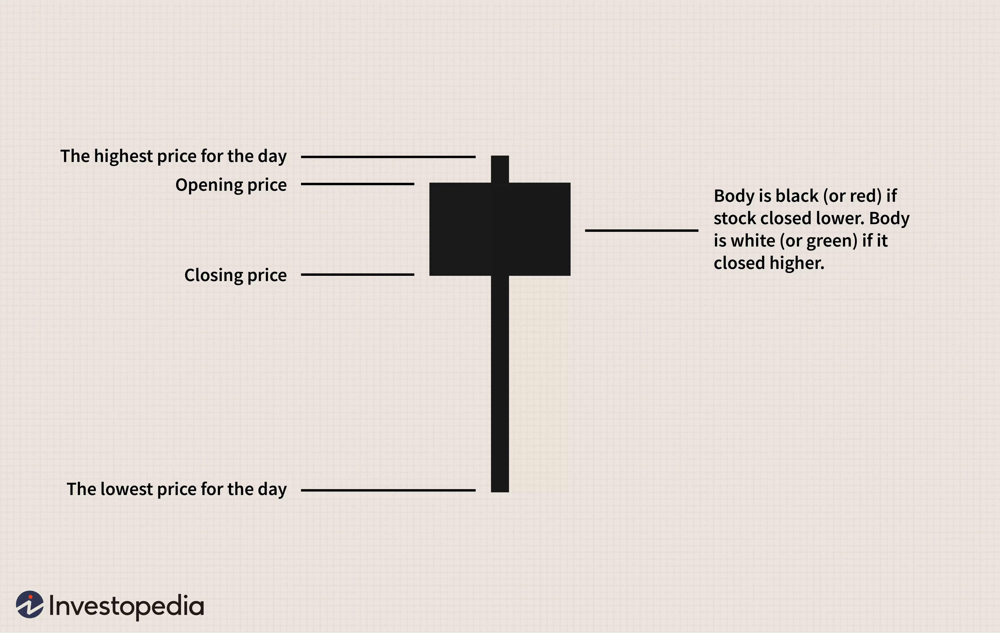
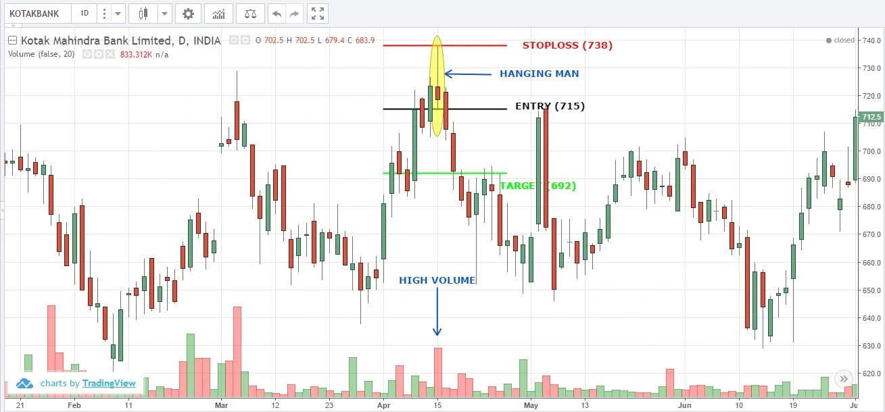
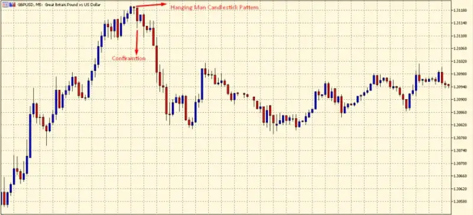

# Hanging Man Candlestick Pattern for Stock/Crypto Trading

## What is it?

Hanging Man is a bearish reversal candlestick pattern with a longer lower shadow and smaller entities.
**This candlestick pattern appears at the end of an uptrend, indicating further weakness in price movements.**

It was formed when the bulls raised prices and are now unable to apply further pressure.
**There is no upper shadow and the lower shadow is twice the length of its body.**
This model gives traders the opportunity to close a buy position and enter a short position

## Formation of Hanging Man Pattern

When the opening price, the highest price, and the closing price are approximately the same, a hanging man form will be formed, just like a [hammer](https://anothertechs.com/crypto/hammer-signal/). In addition, there is a very long lower shadow, which should be at least twice the actual length of the body.

## What does Red and Green Hanging Man tell us?

When the high and open prices are equal, a bearish **red** hanging candle forms. This pattern is considered a stronger bearish signal than when the high and close prices are the same, forming a **green** hanging man.

Although the **green** candlestick is still bearish, it is considered less bearish due to the close of the day.

## How to identify this pattern:

Here are some points to consider when identifying this pattern on a candlestick chart:

1. There is little or no upper shadow.
2. The length of the lower shadow must be twice the length of the entity.
3. The entity must be on the upper side of the candle.

## Trading on Hangin Man Pattern

For some traders, the confirmation candle the next day, coupled with the fact that the uptrend line support was broken, gave a potential signal to go short.

It is important to reiterate that hanging man patterns are not a sign of potential shorting; Other indicators (such as trend line breakouts or confirmation candles) should be used to determine to sell signals.

## Formation Examples

