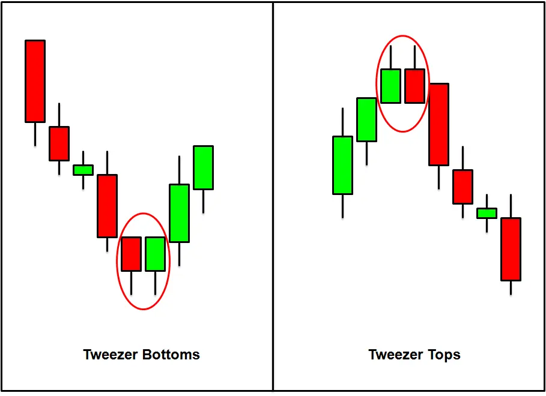
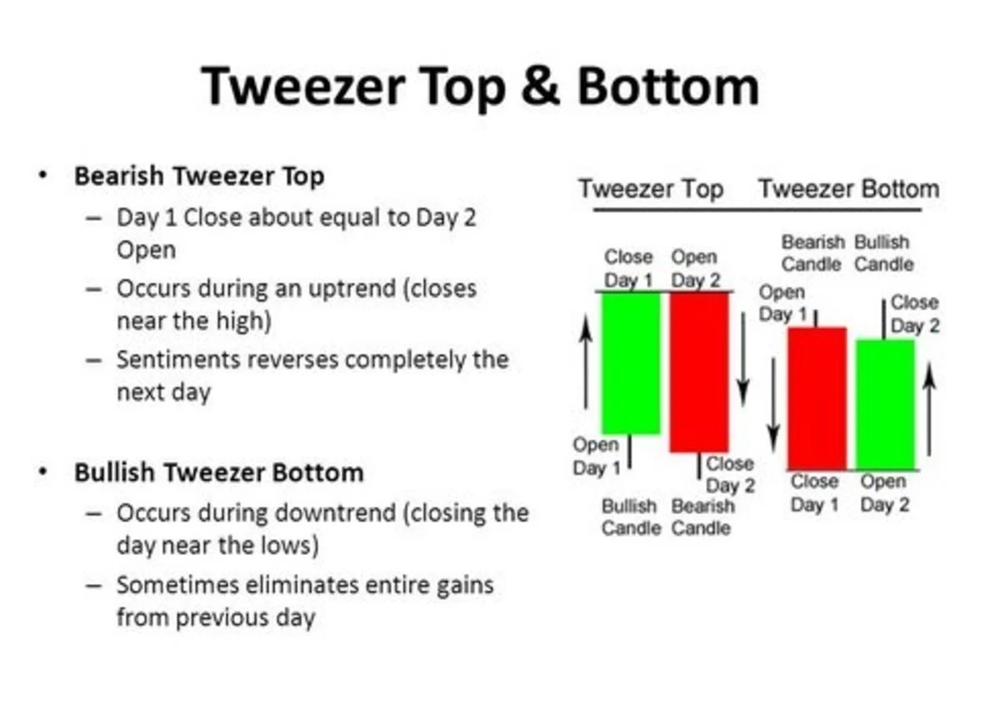
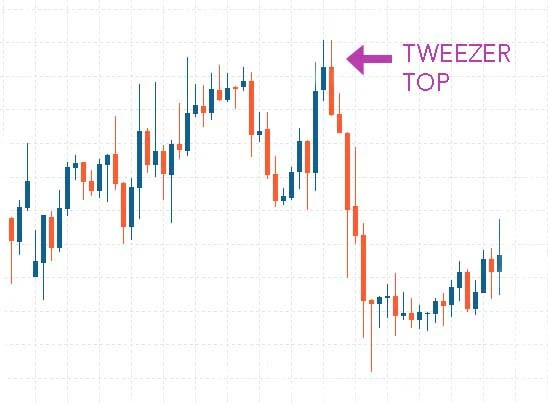
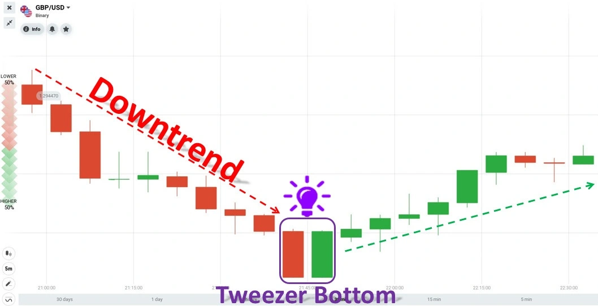

This guide will explain Tweezer Top candlesticks and Bottom candlesticks and how traders use them to detect market shifts.

We will examine the relationship between tweezer top and tweezer bottom candlesticks, how to find these formations on charts, and how they indicate directional movement.

## What does Tweezer means?

A tweezer can be described as a technical analysis pattern that uses two candlesticks. It can indicate a market top or bottom. Tweezer patterns can be reverse patterns. They are formed when more than one candlestick touches the exact bottom for a bottom pattern for a market tweezer, or two or more candlesticks touch a top for a top pattern for a market tweezer.

Tweezer bottoms can be considered short-term bullish patterns that reverse, while tweezer tops can be regarded as bearish reversals. Both formations were unable to push the top and bottom further. Each type of pattern requires careful observation and research in order to be correctly understood.

1. When bulls push prices higher during an uptrend, a bearish tweezer tip is often seen. This is generally considered a strong bullish signal. On the second day, traders reverse their market sentiment. The market opens but does not surpass the previous day's highs and then heads straight down, often eliminating most prior period gains.

2. A bullish tweezer top is achieved when prices are falling, and bears continue to push them lower. This is usually a solid bearish trend. Day 2 is a reversal. Prices open but don't breach the previous day's lows and then head sharply higher. Day 2's bullish move can quickly erase losses of the prior trading session.

Tweezers are an investment strategy that allows traders to be more precise in identifying market trends. Although tweezers come in many different forms, there are a few common traits. These candlestick patterns often appear at market-turning points. They can be used to analyze the market or provide signals to trend traders.

In the popular Japanese candlestick charting technique book Japanese Candlestick Charting Techniques, Steve Nison made tweezers a mainstream item. A red candle that is dark or dark indicates that the close was below the opening, while a green or white candle signifies that the closing price was higher than the opening.

## What make Tweezers so important candlestick pattern?

- It may be a leading indicator indicating a short-term trend reversal or price swing may be taking place. It is similar to a pair of tweezers "plucking" a top or bottom on a chart.
- A completed tweezer may be used to verify if there has been a significant high or low.
- Tweezer may be used to confirm or reinforce other indicators of reversal.
- A failed tweezer can indicate a continuous movement is in progress and may be helpful in stop-loss placement.
- Tweezer top "fails" if a new high is reached immediately after completion (candle), while a tweezer base "fails" if the next candle reaches a new low.

## Tweezer Top Candlestick Pattern

The tweezer-top candlestick pattern, which features two candlesticks, is a bearish reversal type. The pattern begins with a green candlestick that appears when a stock is experiencing an uptrend. The second day opens high and makes a similar high to the first.

### What does Tweezer Top Candlestick Chart Pattern tell us?

The Tweezer Top candlestick patterns are formed when the prior trend is up. The bullish candlestick looks like it is continuing the uptrend. The high of the bearish candle's second day's high on the following day indicates resistance. The bulls appear to increase the price, but they aren't willing to buy at higher values. The highest candles that have almost the same height as the top indicate resistance. This signal may also mean that an uptrend could be reversed and form a downtrend. The bearish reversal will be confirmed the next day when the bearish candle forms.

### Criteria for identifying tweezer tops

**Three factors identify tweezer tops:**

1. The stock market is currently in an uptrend
2. A solid green body is seen on the first day
3. The formation of the red bodies on the second day. This has a similar high to the day before.

### How do you interpret the reading of top patterns from tweezer?

The resistance zone is indicated by the second candle's high. Despite the bulls pushing the price up, they don't want to buy at higher rates. The bears are forced to take action and move the price down. The strength of resistance is also indicated by identical height of the highest candles, which suggests that an uptrend could pause or reverse and turn into a downtrend. The third-day bearish reversal candles are made when the trend reversal candle is usually confirmed.

## Tweezer Bottom Candlestick Pattern

The bullish reversal pattern is called the tweezer top. A red candlestick marks this candlestick pattern on the first day when there is a downtrend. The second day's low is similar to the day before.

### What does Tweezer Top Candlestick Chart Pattern tell us?

The Tweezer Bottom candlestick patterns are an indication of a downtrend. The formation of a bearish tweezer candlestick looks like a continuation of the current downtrend. The low of the bullish candle indicates the support level on the following day. The strength of the support is indicated by the bottom candles that are almost equal in low. This signal may indicate that the downtrend could be reversed and form an uptrend. The bulls then step in and move the price up.
The bullish reversal will be confirmed when the bullish candle forms the next day.

### Criteria for identifying tweezer bottoms

**These are the three things that can help you identify tweezer bottoms**

1. The stock market is currently in a downtrend
2. A solid red body was observed the first day
3. The formation of the green bodies on the second day. This has a low similar to the day before.

### How do you interpret the reading of Bottom patterns from tweezer?

The second candle's low indicates a support area. The bears are pushing the price lower, but they won't sell below that price. The bulls then step in and drive the price up with great force. The support strength is evident in the identical lows of both candles, which indicates that the downtrends could reverse or pause. The trend is confirmed by the third day of bullish reversal candle formation.

### Refrences

- http://midasinvestments.blogspot.com/2013/05/forex-tutorials-part-8-advanced.html
- https://fxsignl.blogspot.com/2019/10/tweezer-bottom-candlestick-pattern.html
- https://hitandruncandlesticks.com/tweezer-top-candlestick-pattern/
- https://iqtradingpro.com/make-money-iq-option-tweezer-candlestick-pattern/
