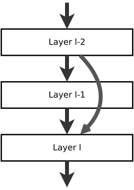
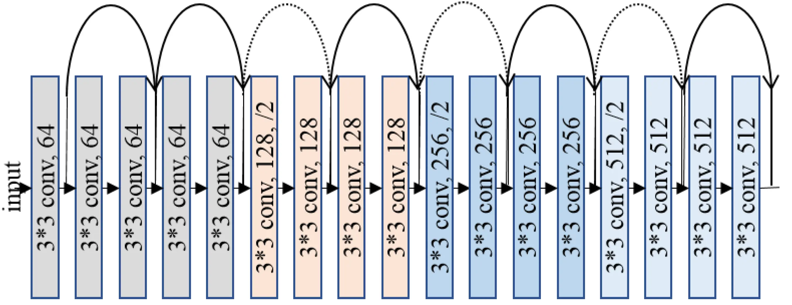

# Understanding and Implimenting ResNet using PyTorch

## Deep Convolution Neural Network

In our [last article](https://anothertechs.com/programming/neural-network/cn/) we have seen how a simple convolution neural network works.A **Deep Convolution Neural Network** are the network which consists of many hidden layer for examples _AlexNet_ which consist of 8 layer where first 5 were convlutional layer and last 3 were full connected layer or _VGGNet_ which consists of 16 convolution layer.

The problem with these deep neural network were as you increase the layer we start seeing degradation problem. Or to put it in another word as we increase depth of the network the accuracy gets saturated and starts degrading rapidly. In a deep neural network as we perform back-propogation, repeated mulitplication for finding optimal solution makes gradient very small which result in degradation. This problem is often called vanishing gradient/exploding gradient.

## ResNet(or Residual Network)

ResNet solve this degradation problem, is by skipping connection or layer. Skipping connection means, consider input x and this input is passed through stack of neural network layers and produce f(x) and this f(x) is then added to original input x.So our ouput will be:

H(x) = f(x) + x



So, instead of mapping direct function of x -> y with a function f(x), here we define a residual function using f(x) = H(x) - x. Which can be reframed to H(x) = f(x) + x, where f(x) represent stack of non-linear layers and x represent identity function. From this if the identity mapping is optimal we can easily put f(x) = 0 simply by putting value of weight to 0. So the f(x) is what authors call residual function.

This mapping ensure that higher layer will perfrom at least as good as lower layer, and not worse.

## Implimenting ResNet

Now let's impliment ResNet model. Here I will be using ResNet18 model which consists of 18 layers. The dataset I will be using is _dog-vs-cat_ which i have downloaded form kaggle websites. Our model will classify images of dogs and cats.

### Architecture



In the above diagram first we take input image which consists 3 channel(RGB) passed it to convolution layer of _kernel_size_ = 3 and get 64 channel ouput.
The convolution block between the curved arrow represent a _Residual Block_ which will consists of:
convolution layer -> Batch Normalization -> ReLU activation -> convolution layer.

Ouput of these rediual block is than added to the initial input(i.e x) of residual block.After adding the ouput is than passed to ReLU activation function for next layer.

The dotted arrow represent that the output dimenssion of residual has changed so we also have to change the dimenssion of the input which is passed to that rediual block(i.e x) for adding it because adding is only possbile if the dimenssion are same.

The last layer of this architecture is a _Linear Layer_ which will take the input and gives us ouput i.e wheater it is dog or cat.

### Code

Let's first our import necessay libraries:

```python
from PIL import Image
import torch.optim as optim
from tqdm import tqdm
from torchvision import transforms
import torch.nn.functional as F
import torch.nn as nn
import torchvision.datasets as dt
import torch
import os

device = torch.device("cuda:0" if torch.cuda.is_available() else "cpu")

PREPROCESS = transforms.Compose([transforms.Resize(256),
                        transforms.CenterCrop(224),
                        transforms.ToTensor(),
                        transforms.Normalize(mean = [0.485,0.456,0.406],std = [0.229,0.224,0.225])])

```

PyTorch provides very good class `transforms` which are use for modifying and transfoming image.`transforms.Compose` is use to combine or chained different transformation of image. This is used to build transformation pipeline.

Now let's get out dataset:

```python
def get_dataset(train = True):
    if train:
        trainset = dt.ImageFolder(root = "./train/",transform = PREPROCESS)
        train_loader = torch.utils.data.DataLoader(trainset,batch_size = 8,shuffle=True)
        return train_loader
    else:
        testset = dt.ImageFolder(root = "./test/",transform = PREPROCESS)
        test_loader = torch.utils.data.DataLoader(trainset,batch_size = 8,shuffle=True)
        return test_loader
```

Next let's write our _Residual Block_:

```python
class ResidualBlock(nn.Module):
    expansion = 1
    def __init__(self, inchannel, outchannel, stride=1):
        super(ResidualBlock, self).__init__()
        self.conv1 = nn.Sequential(
                        nn.Conv2d(inchannel, outchannel, kernel_size=3, stride=stride, padding=1, bias=False),
                        nn.BatchNorm2d(outchannel),
                        )
        self.conv2  = nn.Sequential(
                        nn.Conv2d(outchannel, outchannel, kernel_size=3, stride=1, padding=1, bias=False),
                        nn.BatchNorm2d(outchannel)
                    )
        self.skip = nn.Sequential()
        if stride != 1 or inchannel != self.expansion * outchannel:
            self.skip = nn.Sequential(
                nn.Conv2d(inchannel, self.expansion * outchannel, kernel_size=1, stride=stride, bias=False),
                nn.BatchNorm2d(self.expansion * outchannel)
            )

    def forward(self, X):
        out = F.relu(self.conv1(X))
        out = self.conv2(out)
        out += self.skip(X)
        out = F.relu(out)
        return out
```

In the [last](https://anothertechs.com/programming/neural-network/cnn/) article I have explain why we use `nn.Module` in our class so, I am going to skip that part.
We have created two convolution layer `self.conv1` and `self.conv2` just like in diagram.
The `self.skip` is our shortcut layer which will be added to the output of `self.conv2`.
The "if" part in `__init__()` method checks weather the dimenssion of `self.conv2` will change or not. If it changes than we have to change the ouput dimenssion of input by passing it to `nn.Conv2d` layer.
In `forward()` method it is straight forward that how our data will flow.

Now let's write our Model class or ResNet class:

```python
class Model(nn.Module):
    def __init__(self, ResidualBlock, num_classes):
        super(Model, self).__init__()
        self.inchannel = 64
        self.conv1 = nn.Sequential(
            nn.Conv2d(3, 64, kernel_size=3, stride=1, padding=1, bias=False),
            nn.BatchNorm2d(64),
        )
        self.layer1 = self.make_layer(ResidualBlock, 64,  2, stride=1)
        self.layer2 = self.make_layer(ResidualBlock, 128, 2, stride=2)
        self.layer3 = self.make_layer(ResidualBlock, 256, 2, stride=2)
        self.layer4 = self.make_layer(ResidualBlock, 512, 2, stride=2)
        self.fc = nn.Linear(512*ResidualBlock.expansion, num_classes)

    def make_layer(self, block, channels, num_blocks, stride):
        strides = [stride] + [1] * (num_blocks - 1)
        layers = []
        for stride in strides:
            layers.append(block(self.inchannel, channels, stride))
            self.inchannel = channels * block.expansion
        return nn.Sequential(*layers)

    def forward(self, x):
        out = F.relu(self.conv1(x))
        out = self.layer1(out)
        out = self.layer2(out)
        out = self.layer3(out)
        out = self.layer4(out)
        out = F.avg_pool2d(out, out.size()[3])
        out = torch.flatten(out,1 )
        out = self.fc(out)
        return out
```

In `__init__()` method `self.conv1` is the layer where we will take our input image of channel 3 (RGB) and will produce 64 output channel.Then we create 4 layer using `make_layer` method and each layer consists of 2 `ResidualBlock`.
And the last layer(`self.fc`) is our `Linear` layer which will give us ouput weather it is _dog or cat_.

In `forward` method before passing it to `self.fc` layer we firt `flatten` or reshape our matrics to 1D.

Now let's define our loss function and optimizer:

```python
if __name__ == '__main__':
    resnet = Model(ResidualBlock,num_classes = 2)
    if torch.cuda.is_available():
        resnet.cuda()
    print(resnet)

    criterion = nn.CrossEntropyLoss()
    optimizer = torch.optim.SGD(resnet.parameters(),lr = 0.01)

```

I have used here `CrossEntropyLoss() and `SGD``` optimizer.

### Trainning

Let's train our model:

```python
    train = get_dataset(train = True)

    for epoch in tqdm(range(10)):
        for i,(images,target) in enumerate(train):
            images = images.to(device)
            target = target.to(device)

            out = resnet(images)
            loss = criterion(out,target)
            print(loss)

            # Back-propogation
            optimizer.zero_grad()
            loss.backward()
            optimizer.step()

            _,pred = torch.max(out.data,1)
            correct = (pred == target).sum().item()

            if i % 100 == 0:
                torch.save(resnet.state_dict(),"model")
                print(f" epoch: {epoch}\tloss: {loss.data}\tAccuracy: {(correct/target.size(0)) * 100}%")
```

I have used 10 epochs to train the model. `optimizer.zero_grad()` method is used to make gradient to 0. Next we call `backword()` on our loss variable to perfrom back-propogation. After the gradient has been calculated we optimize our model by using `optimizer.step()` method.

### Testing

```python
    test = get_data(train = False)

    with torch.no_grad():
        correct = 0
        total = 0
        for i,(images,target) in tqdm(enumerate(test)):
            images = images.to(device)
            target = target.to(device)

            out = resnet(images)
            _,pred = torch.max(out.data,1)
            total += target.size(0)
            correct += (pred == target).sum().item()
        print(f"Accuracy: {(correct/total) * 100}")
```

Since we don't need to calculate weight during back-propogation while testing our model we use `torch.no_grad` method. Rest part is same as training.

After 10 epochs I got accuracy of 93.23%.
