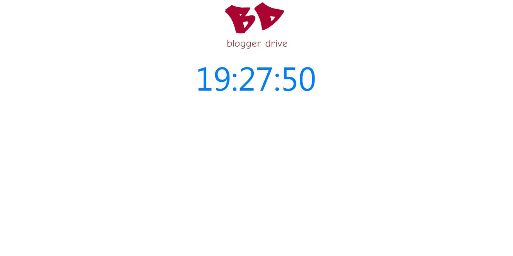

## What are state and props in Reactjs

In React js we develop different component to develop complex UI.To create dataflow between different component React uses `state` and `porps`.
Because of `state` and `props` it is able to render component with dynamic data.

## Props

**Props** stands for properties. It is an object which look like HTML attributes and also works similar to the HTML attrubute.Props are immutable i.e. we cant not change the value of props.
Props are used for sending the data from one component to other component.They are treated as pure javascript function whoes parameter value cannot be changed

Let's have a quick look at how props works:

```javascript
import React from "react";
import "./state_prop.css";

class Demo extends React.Component {
  constructor(props) {
    super(props);
  }
  render() {
    return (
      <div className="App">
        
        <p className="text-primary"> {this.props.time} </p>
      </div>
    );
  }
}

export default Demo;
```

The above code is simple. We have a class **Demo** that render the value of props passed to it which is nothing but and image file and the current time.
Now let's look at our `index.js` file where we have initialize our props value.

```javascript
import React from "react";
import ReactDOM from "react-dom";
import "./index.css";
import Demo from "./state_prop";
import * as serviceWorker from "./serviceWorker";

var date = new Date();
var t = date.getHours() + ":" + date.getMinutes() + ":" + date.getSeconds();

ReactDOM.render(
  <Demo img_url={require("./img1.jpg")} time={t} />,
  document.getElementById("root")
);

// If you want your app to work offline and load faster, you can change
// unregister() to register() below. Note this comes with some pitfalls.
// Learn more about service workers: https://bit.ly/CRA-PWA
serviceWorker.unregister();
```

As you can see we have passed to props `img_url` and `time`.As we have disccused earlier props are immutable so if you try to change the value of the props it will give you error.

If you have done everything write the output component will some what look like this:



## State

**State** are used to store the data of that component.They are used to update compnent whenever some event occur for example _clicking button_,_pressing some key_ etc.Whenever some event occur the component will re-render itself.
State are mutable i.e. we can change the value of state by using `setState()` function. Whenever a class inherits the class React.Component it’s constructor will automatically assigns attribute state to the class with intial value is set to null.

Let's see how state works with an example.
We will try to modify our last component but here instead of displaying time once we will use state to update the clock on ever second.

```javascript
import React from "react";
import "./state_prop.css";

class Demo extends React.Component {
  constructor(props) {
    super(props);
    this.state = { time: null };
  }
  componentDidMount() {
    setInterval(() => {
      var date = new Date();
      this.setState({
        time:
          date.getHours() + ":" + date.getMinutes() + ":" + date.getSeconds(),
      });
    }, 1000);
  }

  render() {
    return (
      <div className="App">
        
        <p className="text-primary"> {this.state.time} </p>
      </div>
    );
  }
}

export default Demo;
```

As you can see the initial value of the state is null. We have used here `setInterval()` function to trigger the event in every second.As soon as the event is triggred we change to value of the state by using `setState()` function and the component re-renders itself.

Try this, if everything went fine you will see component updating its value on every second.
