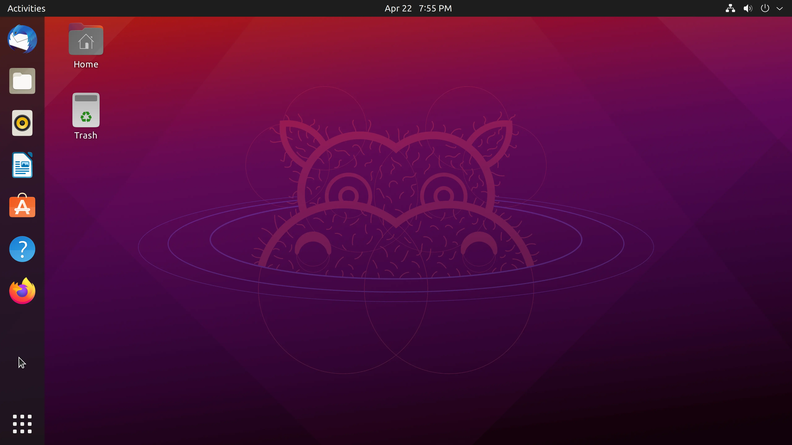
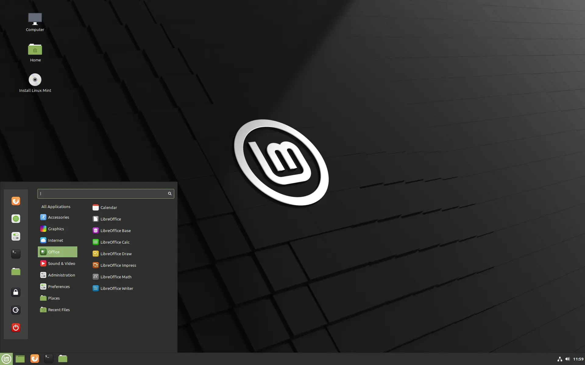
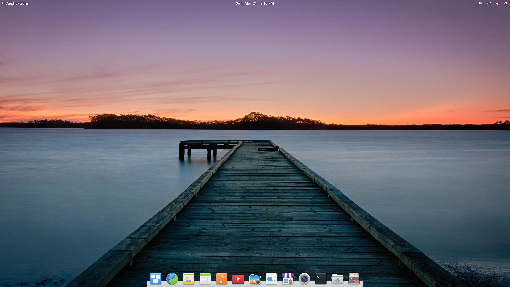
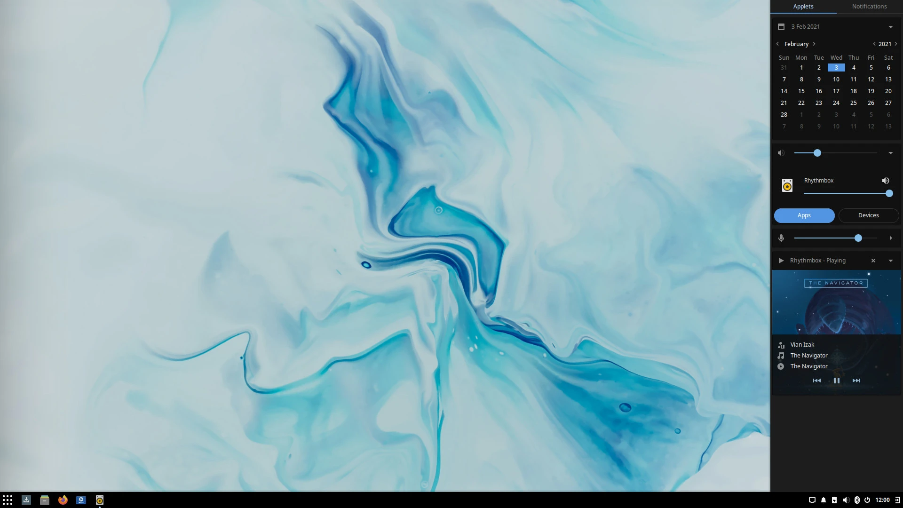
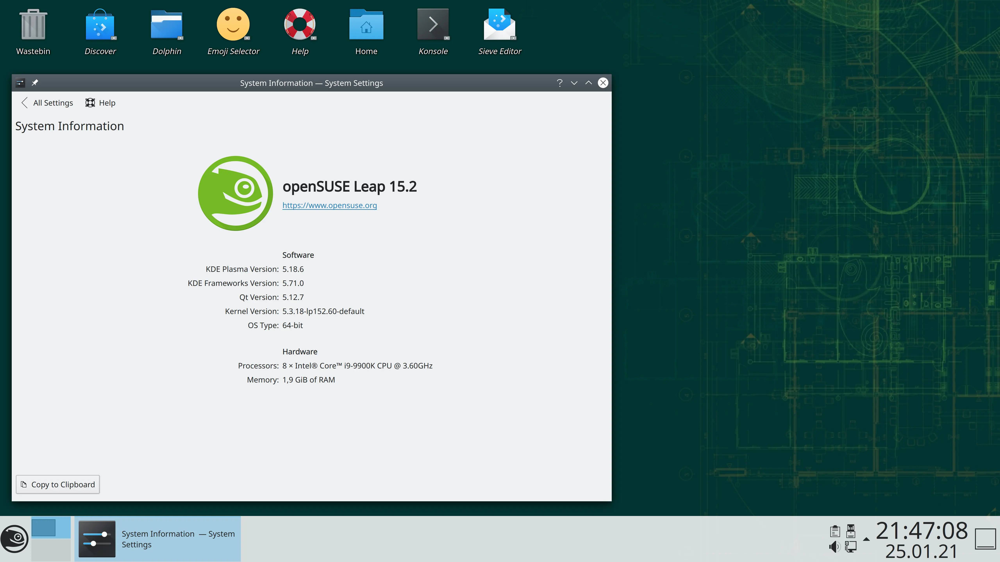
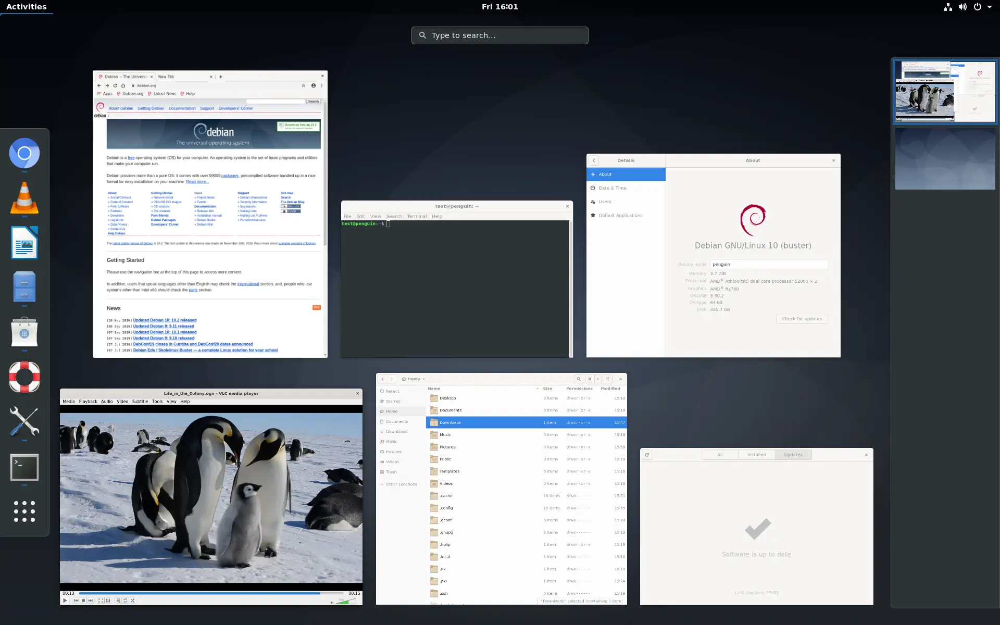

# Top linux distros to try in 2021

Looking for a new Linux experience? Get to know the best Linux
distribution for all user levels, from beginners to experts.

As a free and open-source operating system, Linux continues to spread its wings,
attracts the attention of novices and experienced people.

Check out some of these desks and set up a desk that suits your interests and abilities.

## 1. Ubuntu

Using one of the most popular
OS platforms, you can't go wrong. It is very suitable for users who want to get involved in Linux every day while learning the basics of
.

Technically speaking, Ubuntu is derived from Debian and comes with
Long Term Team Support (LTS) releases. You can install a stable version of the operating system on the
desktop without unnecessary obstacles.

It comes with the GNOME desktop environment by default and is pre-installed with
ready-to-use applications such as Firefox, LibreOffice, music players, and video players (such as Rhythmbox and Audacious) to use.

[Download Ubuntu](https://ubuntu.com/download/desktop)

## 2. Linux Mint

Looking for a lightweight Linux distribution? If so, dial
Linux Mint. It has the essence of Debian and Ubuntu, providing a user-friendly
-person experience for both novice and advanced users.

Since it is community-driven, you can let
do whatever you want. Although it is based on Ubuntu, Mint is not equipped with a GNOME
desktop, but with its own native
environments, such as Xfce, Cinnamon, and MATE.

It is only available in 64-bit, for example. After installation, you can enjoy the look and feel of
, rich polished icons, new themes,
modified taskbar and high-resolution background images.

[Download Linux Mint](https://linuxmint.com/download.php)

## 3. Elementory OS

If you are a big fan of Mac, then you will love Elementary OS. This operating system replicates the look and feel of Mac and has proven to be the ideal platform for designers and creatives. It's modern, stylish, and intuitive
desktop design is just that.

The initial setup and design are quite lightweight, and the focus on productivity and privacy. In the latest version, Elementary OS provides
with multitasking view, do not disturb mode, and picture-in-picture mode to ensure
has the best productivity experience.

Like Ubuntu, it is also based on GNOME and equipped with the
Pantheon desktop environment.

[Download Elementory OS](https://elementary.io/)

## 4. Solus

Although it is a general-purpose Linux
operating system, Solus provides developers with an ideal desktop environment. It supports various advanced editors and IDE(Integrated development environment).

Developers can manage code in control systems such as Git, GitKraken,
Bazaar, and Git-Cola. In addition, Solus supports
different programming languages, including Go, Rust, PHP, Node.js, and Ruby.

Finally, you can download various developer tools from their built-in
repositories to enhance your long-term experience.

[Download Solus](https://getsol.us/download/)

## 5. OpenSUSE

OpenSUSE provides
open-source tools available for developers and system administrators. This is a community-driven environment, which means that
provides OpenSUSE users with what they want.

What really makes this platform great is its robustness and the ability to install
directly on other Linux desktop environments (KDE, MATE, GNOME, Cinnamon, etc.).

Currently, many other open-source natives
versions generally lack these features.

[Download OpenSUSE](https://get.opensuse.org/)

## 6. FEDORA.

Fedora is often mentioned as one of the most popular Linux distributions and is also for good reason. Like OpenSUSE,
is also an open-source operating system, free to use, reliable, and easy to use.

Fedora offers three different versions, including workstations,
servers, and the Internet of Things. Advanced users can choose to customize the operating system according to their needs.

However, unlike some other distributions, only a limited number of pre-installed
applications are available in this release.

## 7. Debian

Debian is one of the most stable and recognized
operating systems provided by Linux. It forms the basis of other environments, such as
Ubuntu, PureOS, SteamOS, Knoppix, Tails and so on.

This release is known for its simple and smooth updates because
provides its updates within the set release cycle. Users can use the
Live CD to install this operating system, which includes the easy-to-use Calamares
installer.

The installer mentioned above is very suitable for beginners; after that, 4,444 advanced users can use the full-featured installer on their systems.

[Dowload Debian](https://www.debian.org/)
