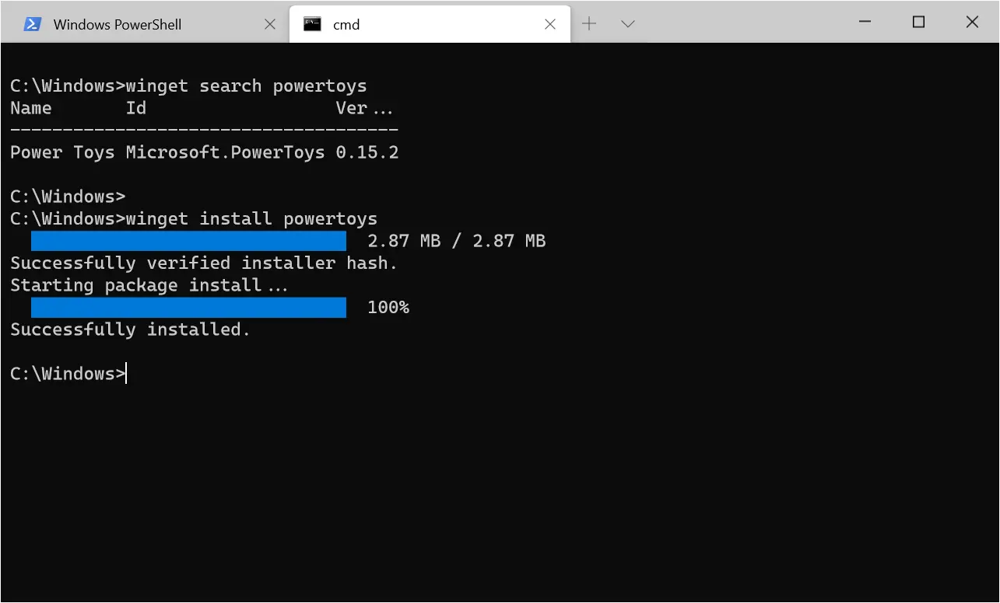

If you have ever used any time today, then you will be familiar with the
idea of the package manager. When I use it to switch to
, I might miss that package manager very much.

It's been on Windows 10 for some time, like the excellent third-party solution
Chocolatey. But now, Microsoft has its own Windows Package Manager called.

After being previewed for a whole year, it recently reached v1.0. It has not yet come out with Windows, but it is ready and does not require batches to install it on your computer. This is what you need to know.

## What is the Windows Package Manager?

Windows Package Manager is a command-line tool used to manage
software, which can be used in Windows 10 via command prompt or. The
implementation is very similar to the Linux package manager.

Windows Package Manager itself does not host any packages. Instead,
users create lists, add these lists to the central repository, and then formulate these lists to get software from the
common home page on the web.

It could be Github, a software developer's website,
or even a Microsoft Store. One of the benefits of the Windows
Package Manager is how easy it is to create a manifest to install the
software.

Of course, this is more than just installing things on the PC. During the
process of the preview period, the feature list increased significantly. With the
reaching v1.0. Using it to manage the
software on your own PC or multiple remote computers is a feasible proposal if you work in the company.

## Installing Windows Package Manager

If you were a Windows Package Manager user before the
preview stage, you do not need to perform any special actions to get v1.0. The
is still shipped the same way, so suppose you have downloaded the
update to the app installer on the Microsoft Store, or you are using the Windows 10
insider build, then you should be happy. You can verify this by typing
`winget --info` in the terminal.

For beginners, there is now a more simplified way to install
Windows Package Manager. There is a direct link
in the v1.0, but you can also go directly and get it from there. In any case, Github is worth, because there is a lot of useful information there.

Get the latest version from the release page by downloading the
`.appxbundle` file. After downloading, just open it like any Windows
executable file, and the built-in "application installer" of Windows 10 will do the rest.

## Finding software/application using Windows Package Manager

One of the most basic functions of Windows Package Manager and number
is that you want to install it to install
an application on your Windows 10 PC. But Windows Package Manager can also help you find the application you are looking for.

The repository is currently on Github, but it has to be crawled in a huge list, which is hardly an easy-to-use experience. On the contrary, there are
two important commands to remember:

```batch
winget install package_name
winget search package_name
```

All Windows package manager commands are called using the term `winget`
. So, for example, if you want to search for Microsoft PowerShell
, you can enter the following command:

```batch
winget  search powertoys
```



You will then see a table showing
packages that match your search terms. It will contain the specific ID you need
to download. You don't always need it, but use something like
PowerShell, there are multiple versions available, you will need it. To download, you should enter:

```batch
winget Install Microsoft.Powershell
```

Or, if you prefer something with an attractive user interface,
has an excellent third-party tool that you should check. Extract's entire Windows Package Manager repository, but make
look easier. An additional benefit is that it can generate the installation scripts required by multiple applications simultaneously.
only needs to be simply copied and pasted.

## Uninstalling software/application using Windows Package Manager

The uninstall feature is one of the features added later during the Windows
package manager preview and must be manually enabled in the
config JSON file. As of v1.0, this is no longer the case, and the
functions have been fully integrated into it.

To uninstall the application using the Windows Package Manager, the command template
is as follows:

```batch
winget uninstall package_name
```

This is all you have to do. The feature currently appears to be limited to
packages installed using the Windows Package Manager.
