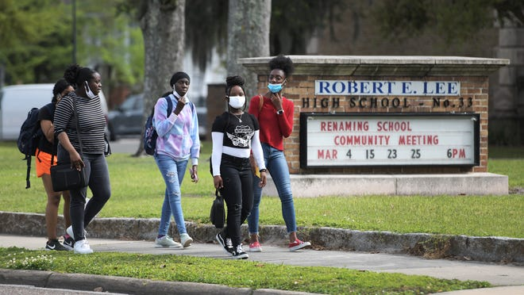

Dina Sanichar was raised by wolves in India's Uttar Pradesh jungle until hunters found him in 1867 and brought him to an orphanage. He would later serve as Rudyard Kipling's inspiration for the character of Mowgli.

Rudyard Kipling’s novel The Jungle Book tells the story of Mowgli: a boy who was abandoned by his parents and raised by wolves. While he was taught the ways of the animal kingdom, he never learned how to interact with another human being.

Kipling’s famous tale, later adapted into several family films by Walt Disney, ends on an uplifting message about self-discovery and harmony between civilization and nature. However, few people know that it was based on tragic true events.

Dina Sanichar was raised by wolves and spent the first few years of his life thinking he was one. When hunters discovered him lying in a cave, they took him to a nearby orphanage.

```c
int main(int argc,char** argv){
	fprintf(stdout,"This is my world!!")
}
```

There, missionaries tried to teach him all the things he never learned, starting with the basics: walking and talking. However, the gulf between human behavior and animal instinct proved too wide for Sanichar to overcome.

### Dina Sanichar: Raised By Wolves And Hunted By Humans

The year was 1867. The setting: Bulandshahr district, India. One night, a band of hunters made their way through the jungle when they stumbled upon a clearing. Beyond it lay the entrance of a cave that, they believed, was being guarded by a lone wolf.

The hunters prepped to ambush their unsuspecting prey, but they were stopped in their tracks once they realized this animal wasn’t an animal at all. It was a boy, no older than 6. He neither approached the men nor answered their questions.

### Sanichar Struggles To Adjust To The ‘Civilized’ World

During his stay at the Sikandra Mission Orphanage, Sanichar was given a second name: “Wolf Boy.” The missionaries thought it suited him because they believed he was raised by wild animals and had never experienced human contact in his life.

According to their accounts, Sanichar’s behavior resembled that of an animal more than it did a human’s. He walked around on all fours and had difficulty standing on his own two feet. He only ate raw meat and gnawed on bones to sharpen his teeth.

“The facility with which they get along on four feet (hands and feet) is surprising,” Erhardt Lewis, the superintendent of the orphanage, once wrote a faraway colleague. “Before they eat or taste any food they smell it, and when they don’t like the smell they throw it away.”

### From Growling And Howling To Smoking Cigarettes

Communicating with Sanichar was difficult for two reasons. First, he didn’t speak the same language as the missionaries who were taking care of him. Whenever he wanted to express himself, he would growl or howl just like a wolf does.

Second, he also didn’t understand signing. People who don’t speak the same language can usually get close to understanding one another simply by pointing at various objects with their fingers. But because wolves do not point (or have any fingers, for that matter) this universal gesture was probably meaningless to him.

Though Sanichar eventually learned to understand the missionaries, he never learned to speak their language himself. Perhaps because the sounds of human speech were simply too alien to him.

The longer Sanichar stayed at the orphanage, though, the more he began behaving like a human. He learned how to stand upright and, according to the missionaries, began to dress himself. Some say he even picked up the most human trait of all: smoking cigarettes.
